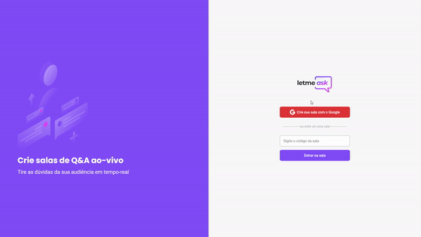

 <h1 align="center">
      
    <p>Crie salas para receber perguntas!</p>
</h1>                           

 <h1 align="center">
      
</h1>     

<h2 align="center">
    <a href="https://letmeask-a2c60.web.app/">Accessar demonstração</a>
</h2>


## 📜Sobre

O projeto **Let Me Ask** é um chat de perguntas criado dentro do curso **Bootcamp NLW Together** com o objetivo de por em prática todo conteúdo apresentado durante o curso.
---
## 🚀Tecnologias utilizadas

O projeto foi desenvolvido utilizando as seguintes tecnologias

- ReactJS
- TypeScript
- Sass
- React-router-dom
- Classnames
- Firebase

---
## Como baixar o projeto

```bash
# Clonar o repositório
$ git clone https://github.com/mjigormj/LetMeAsk.git

# Entrar na pasta do projeto
$ cd LetMeAsk

# Instalar depedências
$ yarn install

#Iniciar o projeto
$ yarn start

```
---
<h2 align="center"> 🌌🪐 Desenvolvido por Igor C.R Silva 🪐🌌 </h2>